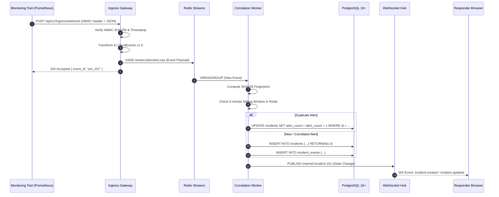
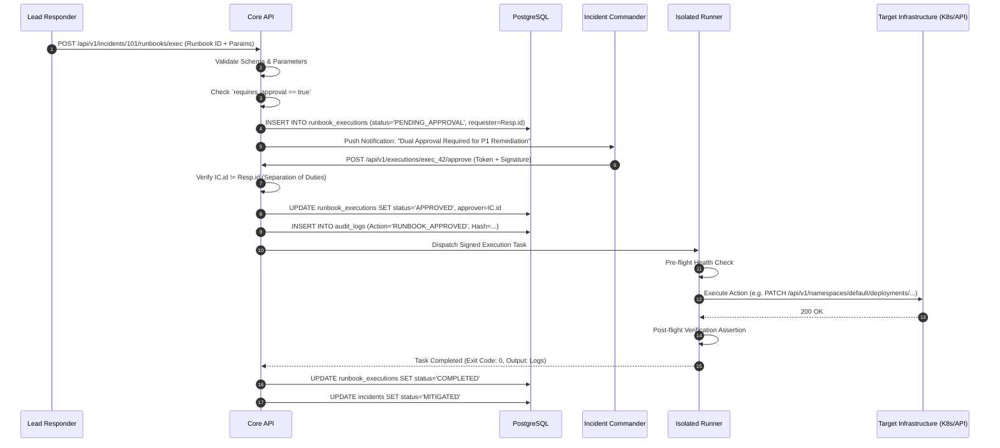

# TITAN System Architecture Specification

**Document Version:** 1.0  
**Phase:** Phase 2 — System Architecture  
**Status:** DRAFT / UNDER REVIEW  
**Author:** Software Architect, Security Engineer, Systems Engineer  
**Date:** September 2026  

---

## 1. Architectural Philosophy & Strategy

TITAN is architected around six core tenets:
1. **Separation of Concerns via Clean Architecture:** Domain logic is strictly isolated from infrastructure, transport protocols, and database drivers.
2. **Modular Monolith for Core Services:** Rather than prematurely splitting into dozens of microservices, TITAN's core application layer is designed as a high-cohesion, low-coupling modular monolith. Clear internal boundaries allow extraction into dedicated microservices if horizontal scaling requirements dictate.
3. **Decoupled Ingestion via Durable Asynchronous Buffering:** Webhook ingress is strictly decoupled from downstream correlation and state processing through persistent message streams (Redis Streams). This prevents alert storms from causing cascading failures in the application or database tiers.
4. **Zero-Trust Execution Sandboxing:** The Runbook Execution Engine is isolated from the control plane. Remediation workers operate with restricted privileges, short-lived tokens, and zero direct write access to the primary database.
5. **Deterministic State Concurrency:** The incident lifecycle is managed by an explicit finite state machine with optimistic concurrency control (`version` column) to guarantee safe multi-user interactions.
6. **Immutable, Tamper-Evident Audit Trails:** All system mutations, approvals, and executions produce hash-chained audit events written to an append-only store with revoked deletion privileges.

---

## 2. System Context & Layered Architecture

```text
                                 [ External Telemetry Sources ]
                         (Prometheus, Datadog, CloudWatch, Custom Webhooks)
                                                │
                                                ▼  HTTPS (HMAC-SHA256)
┌─────────────────────────────────────────────────────────────────────────────────────────────┐
│ 1. EDGE & INGESTION LAYER                                                                   │
│   ┌─────────────────────────────────────────────────────────────────────────────────────┐   │
│   │ TITAN Ingress Gateway (Fastify / Node.js 22 LTS)                                    │   │
│   │  - Rate Limiting (Token Bucket: 1000 burst / 500 sustained req/s)                    │   │
│   │  - HMAC-SHA256 Signature Verification & Replay Protection (Timestamp Check)          │   │
│   │  - Payload Validation & Normalization to CloudEvents v1.0 Schema                     │   │
│   └──────────────────────────────────────────┬──────────────────────────────────────────┘   │
└──────────────────────────────────────────────┼──────────────────────────────────────────────┘
                                               │ Enqueue (XADD)
                                               ▼
┌─────────────────────────────────────────────────────────────────────────────────────────────┐
│ 2. ASYNCHRONOUS BUFFERING LAYER                                                             │
│   ┌─────────────────────────────────────────────────────────────────────────────────────┐   │
│   │ Redis Streams (`stream:telemetry:raw`)                                              │   │
│   │  - Consumer Groups (`cg:correlation-workers`)                                       │   │
│   │  - Persistent, in-memory with AOF disk persistence                                   │   │
│   └──────────────────────────────────────────┬──────────────────────────────────────────┘   │
└──────────────────────────────────────────────┼──────────────────────────────────────────────┘
                                               │ Dequeue (XREADGROUP)
                                               ▼
┌─────────────────────────────────────────────────────────────────────────────────────────────┐
│ 3. APPLICATION & DOMAIN LAYER (TITAN Modular Core)                                          │
│   ┌───────────────────────┐  ┌───────────────────────┐  ┌───────────────────────────────┐   │
│   │ Alert Deduplication   │  │ Correlation & Grouping│  │ Incident State Machine        │   │
│   │ - Fingerprint hashing │  │ - Dependency mapping  │  │ - Deterministic transitions   │   │
│   │ - 5-min sliding window│  │ - Dynamic severity    │  │ - SLA milestone tracking      │   │
│   └───────────────────────┘  └───────────────────────┘  └───────────────────────────────┘   │
│   ┌───────────────────────┐  ┌───────────────────────┐  ┌───────────────────────────────┐   │
│   │ Runbook Orchestrator  │  │ Dual-Custody Gate     │  │ Real-Time Collaboration Hub   │   │
│   │ - YAML parser & validator│ - Two-person sign-off │  │ - WebSocket state sync        │   │
│   │ - Parameter injection │  │ - Cryptographic audit │  │ - Presence tracking           │   │
│   └───────────────────────┘  └───────────────────────┘  └───────────────────────────────┘   │
└──────────────────────────┬───────────────────────────────────────────┬──────────────────────┘
                           │                                           │
                           ▼ Reads / Writes (ACID)                     ▼ Pub/Sub
┌─────────────────────────────────────────────────────┐ ┌─────────────────────────────────────┐
│ 4. DATA & PERSISTENCE LAYER                         │ │ 5. REAL-TIME CLIENT LAYER           │
│   ┌───────────────────────────────────────────────┐ │ │   ┌─────────────────────────────┐   │
│   │ PostgreSQL 16+                                │ │ │   │ Next.js 15 / React 19 SPA   │   │
│   │  - `incidents` (State, Priority, Assignee)    │ │ │   │  - Incident War Room        │   │
│   │  - `alerts` (Normalized CloudEvents JSONB)    │ │ │   │  - Live Timeline Stream     │   │
│   │  - `runbooks` (YAML Definitions, Versions)    │ │ │   │  - Interactive Runbook Hub  │   │
│   │  - `audit_logs` (Append-Only Tamper-Evident)  │ │ │   │  - Observability Dashboard  │   │
│   └───────────────────────────────────────────────┘ │ │   └─────────────────────────────┘   │
└──────────────────────────┬──────────────────────────┘ └─────────────────────────────────────┘
                           │
                           ▼ Dispatch Signed Execution Task (mTLS / Signed Token)
┌─────────────────────────────────────────────────────────────────────────────────────────────┐
│ 6. ISOLATED RUNBOOK EXECUTION RUNNER                                                        │
│   ┌─────────────────────────────────────────────────────────────────────────────────────┐   │
│   │ Ephemeral Worker Container                                                          │   │
│   │  - HTTP / Webhook Invoker (mTLS, scoped egress)                                     │   │
│   │  - Kubernetes API Client (Scoped ServiceAccount, Read/Patch only)                   │   │
│   │  - Zero access to primary PostgreSQL DB                                             │   │
│   │  - Output capture & real-time log streaming back to WebSocket hub                    │   │
│   └─────────────────────────────────────────────────────────────────────────────────────┘   │
└─────────────────────────────────────────────────────────────────────────────────────────────┘
```

---

## 3. Component Breakdown & Boundaries

### 3.1 Ingress Gateway (`apps/gateway`)
- **Responsibilities:** 
  - TLS termination and HTTP connection management.
  - Verification of inbound signatures (`X-Titan-Signature: sha256=...`).
  - Strict payload validation against OpenAPI/JSON Schemas.
  - Conversion of heterogeneous vendor formats (Prometheus Alertmanager, Datadog JSON, AWS SNS) into CloudEvents v1.0.
  - Publishing validated events to `stream:telemetry:raw`.
  - Immediate acknowledgment (`HTTP 202 Accepted` with generated `event_id`).
- **Isolation Guarantee:** Gateway does not perform database queries or invoke external APIs; its only downstream dependency is Redis.

### 3.2 Correlation & Triage Worker (`apps/worker-correlation`)
- **Responsibilities:**
  - Consumes from `stream:telemetry:raw` using a Redis Consumer Group.
  - Generates fingerprint key: `SHA256(source + service + cluster + env + alert_name)`.
  - Queries Redis sliding-window cache (`SET alert:fp:<hash> EX 300 NX`).
  - If fingerprint exists, increments alert occurrence counter on existing incident.
  - If new, queries correlation rules from PostgreSQL (cached in Redis) to determine if alert links to an active open incident.
  - Creates new `Incident` or appends alert to existing `Incident`.
  - Publishes `incident:updated` event to Redis Pub/Sub.

### 3.3 Core Application API (`apps/api`)
- **Responsibilities:**
  - Serves REST endpoints for incidents, runbooks, users, and audit logs.
  - Enforces Role-Based Access Control (RBAC) via JWT middleware.
  - Manages incident lifecycle transitions (`Triggered` $\rightarrow$ `Acknowledged` $\rightarrow$ `Investigating` $\rightarrow$ `Mitigating` $\rightarrow$ `Resolved` $\rightarrow$ `Closed`).
  - Validates and schedules runbook executions.
  - Handles approval workflows for dual-custody gates.

### 3.4 Real-Time WebSocket Hub (`apps/ws-hub`)
- **Responsibilities:**
  - Maintains persistent WebSocket connections with browser clients.
  - Subscribes to Redis Pub/Sub channels (`incident:*`, `runbook:output:*`).
  - Dispatches delta updates to authorized clients subscribed to specific incident war rooms.
  - Tracks responder presence (heartbeats every 15 seconds).

### 3.5 Isolated Runbook Runner (`apps/runner`)
- **Responsibilities:**
  - Polls or receives cryptographically signed execution jobs.
  - Injects transient credentials via secure vault/environment secrets.
  - Executes runbook steps (HTTP API requests, Kubernetes cluster commands).
  - Captures stdout/stderr, step exit codes, and assertion outcomes.
  - Streams logs back to the WebSocket hub.

---

## 4. Data Flow Diagrams

### 4.1 Inbound Telemetry Ingestion & Correlation Flow



### 4.2 Runbook Execution with Dual-Custody Approval Flow



---

## 5. Security & Authentication Architecture

### 5.1 Defense-in-Depth Layers
1. **Perimeter / Transport Security:**
   - Strict TLS 1.3 encryption on all public endpoints.
   - HSTS (`Strict-Transport-Security: max-age=31536000; includeSubDomains; preload`).
   - CORS policy strictly constrained to authorized domain origins.
2. **Ingress Webhook Authentication:**
   - Webhook sources must provide HMAC-SHA256 signature in `X-Titan-Signature`.
   - Replay protection: Ingress requires `X-Titan-Timestamp` within $\pm 300\text{ seconds}$ of system time.
3. **User Authentication & Session Management:**
   - Stateless JWT tokens (signed with RS256 / Ed25519 asymmetric keys).
   - Short-lived Access Tokens (15-minute expiration) + securely stored, rotatable Refresh Tokens (HTTP-only, Secure, SameSite=Strict cookies).
4. **Role-Based Access Control (RBAC) Matrix:**

| Role | View Incidents | Acknowledge / Comment | Trigger Standard Runbooks | Trigger Destructive Runbooks | Approve Dual-Custody | Manage Users / Secrets |
| :--- | :---: | :---: | :---: | :---: | :---: | :---: |
| **Observer** | Yes | No | No | No | No | No |
| **Responder** | Yes | Yes | Yes | Requires Approval | No | No |
| **Incident Commander** | Yes | Yes | Yes | Yes | Yes | No |
| **Admin** | Yes | Yes | Yes | Yes | Yes | Yes |

5. **Cryptographic Audit Trail (Hash-Chaining):**
   - Each audit log row computes:
     $$\text{RowHash}_i = \text{HMAC-SHA256}(\text{RowHash}_{i-1} \parallel \text{Timestamp} \parallel \text{ActorID} \parallel \text{Action} \parallel \text{PayloadHash})$$
   - Any tampering or modification of a historical row invalidates the cryptographic chain.
   - Database role permissions explicitly revoke `UPDATE` and `DELETE` on the `audit_logs` table.

---

## 6. Database Architecture & Schema Design

### 6.1 Entity Relationship Overview
- **`tenants`**: Organization / workspace partition.
- **`users`**: System operators with RBAC roles.
- **`incidents`**: Central state record (status, priority, commander_id, lead_id, version).
- **`alerts`**: Individual telemetry signals received from external sources (normalized CloudEvents stored in JSONB with GIN indexing).
- **`incident_alerts`**: Junction table linking alerts to canonical incidents with correlation score and timestamp.
- **`runbooks`**: Versioned declarative runbook definitions (stored as validated YAML/JSON).
- **`runbook_executions`**: Execution instances (requester, approver, parameters, status, output).
- **`timeline_events`**: Chronological event logs for incident war rooms.
- **`audit_logs`**: Append-only compliance log.

### 6.2 Relational Schema Definition (DDL Preview)

```sql
-- Enable UUID and Cryptographic extensions
CREATE EXTENSION IF NOT EXISTS "uuid-ossp";
CREATE EXTENSION IF NOT EXISTS "pgcrypto";

-- Enum types for strict domain safety
CREATE TYPE incident_status AS ENUM (
    'TRIGGERED',
    'ACKNOWLEDGED',
    'INVESTIGATING',
    'MITIGATING',
    'RESOLVED',
    'CLOSED'
);

CREATE TYPE incident_priority AS ENUM ('P1', 'P2', 'P3', 'P4');
CREATE TYPE user_role AS ENUM ('ADMIN', 'INCIDENT_COMMANDER', 'RESPONDER', 'OBSERVER');
CREATE TYPE execution_status AS ENUM (
    'PENDING_APPROVAL',
    'APPROVED',
    'REJECTED',
    'RUNNING',
    'COMPLETED',
    'FAILED',
    'ROLLED_BACK'
);

-- Core Incidents Table
CREATE TABLE incidents (
    id UUID PRIMARY KEY DEFAULT gen_random_uuid(),
    tenant_id UUID NOT NULL,
    incident_number BIGSERIAL NOT NULL,
    title VARCHAR(255) NOT NULL,
    summary TEXT,
    status incident_status NOT NULL DEFAULT 'TRIGGERED',
    priority incident_priority NOT NULL DEFAULT 'P3',
    commander_id UUID REFERENCES users(id),
    lead_responder_id UUID REFERENCES users(id),
    service_name VARCHAR(128) NOT NULL,
    environment VARCHAR(64) NOT NULL,
    alert_count INT NOT NULL DEFAULT 1,
    version INT NOT NULL DEFAULT 1, -- Optimistic concurrency control
    triggered_at TIMESTAMPTZ NOT NULL DEFAULT NOW(),
    acknowledged_at TIMESTAMPTZ,
    mitigated_at TIMESTAMPTZ,
    resolved_at TIMESTAMPTZ,
    closed_at TIMESTAMPTZ,
    created_at TIMESTAMPTZ NOT NULL DEFAULT NOW(),
    updated_at TIMESTAMPTZ NOT NULL DEFAULT NOW(),
    CONSTRAINT uq_incident_number UNIQUE (tenant_id, incident_number)
);

-- Ingested Normalized Alerts (CloudEvents)
CREATE TABLE alerts (
    id UUID PRIMARY KEY DEFAULT gen_random_uuid(),
    tenant_id UUID NOT NULL,
    event_id VARCHAR(128) NOT NULL UNIQUE,
    fingerprint CHAR(64) NOT NULL,
    source VARCHAR(255) NOT NULL,
    alert_name VARCHAR(128) NOT NULL,
    severity VARCHAR(32) NOT NULL,
    service VARCHAR(128) NOT NULL,
    environment VARCHAR(64) NOT NULL,
    payload JSONB NOT NULL,
    received_at TIMESTAMPTZ NOT NULL DEFAULT NOW()
);

CREATE INDEX idx_alerts_fingerprint ON alerts (fingerprint, received_at DESC);
CREATE INDEX idx_alerts_payload_gin ON alerts USING GIN (payload);

-- Append-Only Cryptographic Audit Log
CREATE TABLE audit_logs (
    id BIGSERIAL PRIMARY KEY,
    tenant_id UUID NOT NULL,
    actor_id UUID,
    actor_ip INET NOT NULL,
    action VARCHAR(64) NOT NULL,
    entity_type VARCHAR(64) NOT NULL,
    entity_id UUID NOT NULL,
    before_state JSONB,
    after_state JSONB,
    prev_hash CHAR(64) NOT NULL,
    row_hash CHAR(64) NOT NULL,
    created_at TIMESTAMPTZ NOT NULL DEFAULT NOW()
);

-- Revoke mutation rights on audit logs to enforce append-only security
REVOKE UPDATE, DELETE, TRUNCATE ON audit_logs FROM PUBLIC;
```

---

## 7. Infrastructure & Deployment Architecture

### 7.1 Local Development Topology (Docker Compose)
- **`titan-gateway`**: Ingress Fastify service (`port 8080`).
- **`titan-api`**: Core REST API service (`port 8000`).
- **`titan-ws`**: Real-time WebSocket service (`port 8081`).
- **`titan-frontend`**: Next.js 15 web application (`port 3000`).
- **`titan-postgres`**: PostgreSQL 16 Alpine (`port 5432`).
- **`titan-redis`**: Redis 7.2 with AOF persistence enabled (`port 6379`).
- **`titan-runner`**: Sandboxed runner worker.

### 7.2 Production Cloud Architecture (Kubernetes)
- Stateless pods managed by Deployments with Horizontal Pod Autoscalers (HPA) targeting CPU 70% and memory 75%.
- Ingress managed via Ingress-NGINX / AWS ALB with cert-manager for automated Let's Encrypt TLS certificates.
- Managed PostgreSQL (AWS RDS / GCP Cloud SQL) configured with Multi-AZ replication.
- Managed Redis (AWS ElastiCache / Redis Enterprise) in cluster mode with automatic failover.
- OpenTelemetry Collector sidecars forwarding metrics and traces to Prometheus / Grafana Tempo.

---
*End of System Architecture Document — Ready for Architectural Decision Records (ADRs).*
