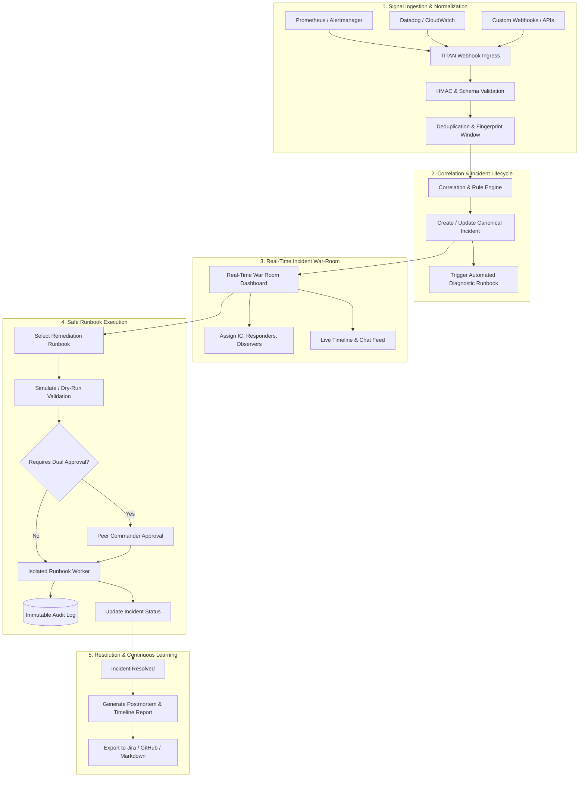

# TITAN: Project Definition Document
**Document Version:** 0.1  
**Status:** DRAFT / UNDER REVIEW  
**Classification:** Internal Engineering  
**Authors:** TITAN Core Architecture Team (Product, Software, Security, DevOps, TPM)  
**Date:** September 2026  

---

## Executive Summary

**Project TITAN** (**T**elemetry, **I**ncident **T**riaging, and **A**utonomous **N**ormalization) is a next-generation, high-availability **Operational Resilience & Automated Incident Remediation Platform**. Designed from the ground up for mission-critical cloud and distributed environments, TITAN bridges the gap between passive observability (metrics, logs, traces, alerts) and active, auditable remediation. 

TITAN continuously ingests heterogeneous operational signals, deduplicates alert noise, correlates cascading alerts into unified canonical incidents, orchestrates real-time incident war-rooms, and provides safe, human-in-the-loop, and automated runbook execution with end-to-end cryptographic auditability.

---

## 1. What TITAN Is

TITAN is a production-grade, distributed operational control plane that unifies:
1. **High-Throughput Signal Ingestion & Normalization**: An extensible gateway that accepts alerts, webhooks, and telemetry events from Prometheus, Datadog, AWS CloudWatch, GCP Cloud Monitoring, Sentry, and custom sources, transforming them into a standard schema (CloudEvents-compliant).
2. **Correlation & Incident State Machine**: An event-driven correlation engine that aggregates related alerts across microservices and infrastructure components into a single actionable **Incident** governed by a strict deterministic state machine.
3. **Collaborative Real-Time War-Room**: An incident command workspace with real-time state synchronization, role delegation (Incident Commander, Scribe, Lead Engineer), timeline tracking, and live telemetry log feeds.
4. **Declarative & Safe Runbook Execution Engine**: A secure workflow runner that executes parameterized diagnostic and remediation runbooks (HTTP APIs, Kubernetes commands, script runners) with fine-grained RBAC, dry-run simulation, and dual-custody authorization.
5. **Continuous Resilience & Post-Incident Intelligence**: Automated timeline generation, Mean-Time-To-Detect (MTTD) and Mean-Time-To-Mitigate (MTTR) analytics, and postmortem export to engineering issue trackers.

---

## 2. The Problem TITAN Solves

Modern cloud-native and distributed systems suffer from four critical operational bottlenecks:

| Problem | Industry Reality | Impact on Organizations |
| :--- | :--- | :--- |
| **Alert Fatigue & Noise** | A single service outage triggers hundreds of downstream alerts across microservices, databases, and message brokers. | Engineers miss critical root-cause signals; on-call burnout increases. |
| **High Mean Time to Mitigate (MTTR)** | Incident responders must manually cross-reference 5+ tools (logs, dashboards, deployment history, wiki runbooks) before taking action. | Prolonged customer-facing outages; SLA penalties; revenue loss. |
| **Dangerous & Unaudited Remediation** | Mitigation is executed via ad-hoc SSH access, unversioned CLI commands, or manual console clicks without review. | High risk of human error, accidental data corruption, and regulatory/audit non-compliance. |
| **Fragmented Knowledge & Tribal Runbooks** | Runbooks live in static wikis (Confluence, Notion) that are outdated, untested, and detached from live systems. | New responders cannot resolve incidents without waking senior engineers; repetitive outages reoccur. |

---

## 3. Why TITAN Should Exist

Existing market solutions are fractured into silos:
- **Observability Systems (e.g., Datadog, Grafana, Dynatrace)** observe system state and generate alerts, but do not provide safe, integrated remediation or structured incident governance.
- **Alert Routing Tools (e.g., PagerDuty, Opsgenie)** page responders, but act merely as notification conduits without contextual diagnostic aggregation or automated remediation pipelines.
- **Workflow Orchestrators (e.g., Temporal, Airflow, Jenkins)** execute jobs, but lack incident-aware state machines, real-time war-room collaboration, and rapid disaster-containment semantics.

**TITAN exists to unite the entire lifecycle:**  
$$\text{Signal Ingestion} \longrightarrow \text{Correlation \& Triage} \longrightarrow \text{Automated Diagnostics} \longrightarrow \text{War-Room Collaboration} \longrightarrow \text{Safe Remediation} \longrightarrow \text{Postmortem}$$  
It eliminates vendor lock-in through open standards, provides zero-trust security boundaries around execution, and treats operational resilience as code.

---

## 4. Target Users & Personas

### Persona 1: Sarah — Site Reliability Engineer (SRE) / On-Call Responder
- **Role:** First responder to production alerts at 3 AM.
- **Needs:** Immediate identification of the root service, instant diagnostic context without running 10 CLI tools, and one-click execution of verified recovery runbooks.
- **Pain Point:** Being paged for 40 cascading alerts and spending 30 minutes figuring out which database connection pool failed first.

### Persona 2: Alex — Incident Commander (IC) / Engineering Manager
- **Role:** Leads severe outage responses (P1/P2) and coordinates multi-team communications.
- **Needs:** Real-time visibility into who is working on what, structured role assignments, automated status broadcasts, and adherence to incident SLAs.
- **Pain Point:** Juggling Zoom links, Slack threads, and Google Docs while trying to coordinate 15 engineers under high pressure.

### Persona 3: Marcus — Platform / Cloud Architect
- **Role:** Designs company-wide infrastructure resilience, Kubernetes platforms, and security standards.
- **Needs:** Standardized runbook definitions checked into Git (Runbooks-as-Code), strict least-privilege access, and automated health checks.
- **Pain Point:** Lack of guardrails when developers run ad-hoc scripts in production environments.

### Persona 4: Elena — Security & Compliance Officer
- **Role:** Ensures SOC2, ISO27001, and HIPAA compliance across infrastructure operations.
- **Needs:** Tamper-evident audit logs showing who authorized and executed every single remediation action, with complete parameter logging.
- **Pain Point:** Unaudited SSH access and untracked manual interventions during emergency maintenance.

---

## 5. Primary User Problems

1. **"I am overwhelmed by alert storms during outages."**
2. **"I don't know what changed recently (deployments, config flags, traffic spikes)."**
3. **"Our runbooks are outdated markdown files that fail when we run them."**
4. **"Executing remediation in production is terrifying because one typo can delete data."**
5. **"Reconstructing timelines for post-mortems takes 4 hours of reading Slack timestamps."**

---

## 6. Core Workflows



---

## 7. Core Features

- **Ingestion & Signal Gateway:** High-throughput HTTP API accepting CloudEvents, Prometheus Alertmanager, Datadog webhooks, and generic JSON payloads with cryptographic signature verification (HMAC-SHA256).
- **Intelligent Deduplication & Correlation:** Sliding-window fingerprint deduplication and rule-based clustering based on service tags, cluster IDs, and error signatures.
- **Incident State Machine Engine:** Enforces formal states (`Triggered`, `Acknowledged`, `Investigating`, `Mitigating`, `Resolved`, `Closed`) with SLA timers and severity scoring (P1 through P4).
- **Real-Time War Room:** Reactive single-page web console with bi-directional WebSocket state sync, responder presence indicators, and live activity streams.
- **Declarative Runbook Engine:** YAML-based workflow definitions supporting:
  - HTTP Webhook actions
  - Kubernetes API operations (e.g. restart pod, scale deployment)
  - Parameterized safe scripts
  - Pre-flight checks and post-flight validation assertions
  - Automatic rollback steps upon failure
- **Dual-Custody Approval Gate:** Configurable safety gates requiring explicit two-person approval for high-impact or destructive operations.
- **Cryptographic Audit Logging:** Append-only, hash-chained audit log recording every event, state change, approval, and execution output.
- **Postmortem & Timeline Generator:** Automated timeline reconstruction capturing alerts, messages, commands, and state transitions with one-click export.

---

## 8. MVP Boundaries (MoSCoW Prioritization)

### Must Have (MVP Scope)
- [x] Webhook Ingestion API with HMAC signature verification.
- [x] Standardized CloudEvents-based internal signal normalization.
- [x] Rule-based alert deduplication (fingerprint + 5-minute sliding window).
- [x] Incident State Machine with full CRUD and state transition validation.
- [x] Severity categorization (P1: Critical, P2: High, P3: Medium, P4: Low).
- [x] Web Dashboard for incident listing, detail view, and state management.
- [x] Real-time event broadcasting (WebSockets) for incident updates.
- [x] Declarative YAML Runbook runner for HTTP and pre-registered safe tasks.
- [x] Role-Based Access Control (Admin, Commander, Responder, Observer).
- [x] Append-only audit logging table with tamper-evident records.
- [x] Basic automated timeline generation on incident resolution.

### Should Have (v1.1 - Immediate Post-MVP)
- Bidirectional Slack bot integration (alert broadcast, acknowledge, runbook trigger).
- Service Dependency Graph mapping (defining upstream/downstream blast radius).
- Multi-tenancy (team and organization boundaries).
- Kubernetes in-cluster Runner agent for safe native Pod/Deployment operations.

### Could Have (v2.0)
- Machine learning-based alert clustering and noise anomaly detection.
- Historical incident similarity scoring ("Incidents like this were resolved by...").
- Automated chaos resilience testing triggers.

### Won't Have (Explicitly Excluded from MVP)
- Building a custom Time-Series Database (TITAN queries Prometheus/Datadog; it does not replace them).
- Customer support helpdesk ticketing (TITAN is for engineering systems resilience, not customer CRM).
- Direct arbitrary shell execution without pre-registered templates (preventing RCE vulnerabilities).

---

## 9. Future Capabilities
- **Autonomous Self-Healing:** Closed-loop automated remediation for pre-verified low-risk failures with automatic rollback on anomaly detection.
- **Multi-Cloud Failover Orchestration:** One-click regional and cloud-provider failover runbooks.
- **Predictive SLO Depletion Guard:** Proactive alerts triggered when error budgets deplete at unsustainable burn rates.

---

## 10. Functional Requirements (FR)

- **FR-01 (Ingestion):** System MUST ingest incoming webhook payloads up to 1,000 requests/second with $p99 < 50\text{ms}$.
- **FR-02 (Authentication):** Ingestion endpoints MUST support HMAC-SHA256 signature verification and API key headers.
- **FR-03 (Deduplication):** System MUST discard duplicate alerts with identical fingerprint hashes within the configurable deduplication window.
- **FR-04 (State Transitions):** Incidents MUST transition strictly along defined paths:  
  $\text{Triggered} \longrightarrow \text{Acknowledged} \longrightarrow \text{Investigating} \longrightarrow \text{Mitigating} \longrightarrow \text{Resolved} \longrightarrow \text{Closed}$. Direct illegal transitions MUST be rejected with HTTP 409 Conflict.
- **FR-05 (Runbook Schema):** Runbooks MUST be defined in declarative YAML adhering to a strict JSON Schema, validating steps, parameters, timeouts, and handlers.
- **FR-06 (Dry-Run):** Every runbook execution MUST support a dry-run / validation mode that evaluates preconditions without altering external infrastructure.
- **FR-07 (Approval):** Any runbook marked `requires_approval: true` MUST halt execution and broadcast an approval request until an authorized peer confirms.
- **FR-08 (Real-Time Sync):** State updates, timeline events, and execution logs MUST be published to connected UI clients within $\le 100\text{ms}$ via WebSockets.
- **FR-09 (Audit Logging):** Every API action, incident transition, runbook launch, and approval decision MUST write an immutable audit log entry containing actor ID, IP, timestamp, and before/after state diff.
- **FR-10 (Timeline Export):** Resolving an incident MUST automatically generate a markdown postmortem report containing chronological events, responders, and duration metrics.

---

## 11. Non-Functional Requirements (NFR)

- **NFR-01 (Availability):** System availability $\ge 99.95\%$ for the ingestion and incident management planes.
- **NFR-02 (Latency):** 
  - Webhook Ingestion Acknowledgment: $p99 \le 50\text{ms}$
  - REST API Read/Write: $p95 \le 150\text{ms}$
  - Real-time WebSocket Event Delivery: $p99 \le 100\text{ms}$
- **NFR-03 (Data Durability):** Zero lost alerts once acknowledged with HTTP 202; persistent queue guarantees at-least-once delivery to workers.
- **NFR-04 (Security):**
  - TLS 1.3 enforced for all external and internal traffic.
  - AES-256-GCM encryption for stored secrets and API tokens.
  - OWASP Top 10 compliance (strict input validation, parameter binding, CSP, CSRF, and CORS policies).
  - Principle of Least Privilege (PoLP) enforced across all database roles and runner tokens.
- **NFR-05 (Scalability):** Stateless application tier horizontally scalable to $N$ instances behind a load balancer; asynchronous message queuing for burst smoothing.
- **NFR-06 (Observability):**
  - Structured JSON logs with distributed trace IDs (`trace_id`, `span_id`).
  - OpenTelemetry tracing instrumentation.
  - Prometheus `/metrics` endpoint exposing Golden Signals (latency, traffic, errors, saturation).
- **NFR-07 (Maintainability):**
  - Modular clean architecture with explicit dependency inversion.
  - $\ge 80\%$ automated test coverage across unit and integration tests.
  - Single-command local environment bootstrapping (`docker compose up`).

---

## 12. Success Metrics

| Metric | Baseline (Without TITAN) | Target (With TITAN) |
| :--- | :--- | :--- |
| **Mean Time to Acknowledge (MTTA)** | 12 minutes | $< 2$ minutes |
| **Mean Time to Mitigate (MTTR)** | 58 minutes | $< 18$ minutes |
| **Alert Noise Reduction Ratio** | $0\%$ (Raw alerts page on-call) | $\ge 75\%$ reduction via correlation |
| **Ingestion Availability** | N/A | $99.99\%$ continuous uptime |
| **Runbook Execution Failure Rate** | $25\%$ (Human error / script drift) | $< 2\%$ (Schema-validated & pre-checked) |
| **Postmortem Completion Time** | 4-6 hours | $< 15$ minutes (automated assembly) |

---

## 13. Major Technical Challenges

1. **Thundering Herd & Alert Storms:** A major network partition can generate 10,000 webhook calls per second. The ingestion layer must quickly ingest and queue events to durable storage without exhausting worker memory or database connection pools.
2. **Deterministic State Concurrency:** Multiple on-call engineers may simultaneously attempt to claim, acknowledge, or execute runbooks on an incident. We must implement optimistic locking or atomic database operations to prevent race conditions.
3. **Execution Sandboxing & Privilege Isolation:** Executing remediation commands against live production environments introduces immense security risk. The execution runner must be isolated from the control plane with zero chance of unauthorized command injection.
4. **Resilient Real-Time Synchronization:** WebSocket connections frequently drop on mobile devices or unstable networks during incidents. The frontend must implement reconnect backoff and timeline delta reconciliation without state corruption.

---

## 14. Major Security Considerations

- **Secret Zero & Credential Management:** Remediation runbooks require API tokens and cloud credentials. These must never be stored in plain text, logged, or exposed in frontend payloads. Envelope encryption using KMS / HashiCorp Vault is required.
- **Input Validation & Command Injection Defense:** Runbook parameters must be strictly constrained by JSON Schema types and regular expressions. Arbitrary shell concatenation is strictly forbidden; all executions must use structured argument arrays.
- **Dual-Custody Enforcement (Two-Person Rule):** P1 critical mitigation actions (e.g. database failover, cluster drain) must require cryptographic sign-off by two distinct authenticated users.
- **Tamper-Evident Audit Logging:** Audit logs must be stored in an append-only table where `UPDATE` and `DELETE` permissions are revoked at the database role level.
- **API Security:** Strict rate-limiting per API key / IP, payload size caps (max 1MB), and HMAC-SHA256 signature verification for all third-party webhooks.

---

## 15. Initial Architecture Hypothesis

```text
[ External Telemetry Sources ]
  (Prometheus, Datadog, AWS, Custom)
              │
              ▼  HTTPS / HMAC
┌────────────────────────────────────────────────────────┐
│               TITAN Ingestion Gateway                   │
│   - Rate Limiter (Token Bucket)                        │
│   - HMAC & Schema Validator                            │
│   - Lightweight Event Normalizer                       │
└─────────────────────────────┬──────────────────────────┘
                              │ Enqueue Event
                              ▼
┌────────────────────────────────────────────────────────┐
│             Persistent Queue (Redis Streams)           │
└─────────────────────────────┬──────────────────────────┘
                              │ Dequeue
                              ▼
┌────────────────────────────────────────────────────────┐
│            TITAN Core Application Services              │
│   ┌──────────────────────────────────────────────────┐ │
│   │ Alert Deduplication & Correlation Worker         │ │
│   ├──────────────────────────────────────────────────┤ │
│   │ Incident State Machine & SLA Engine              │ │
│   ├──────────────────────────────────────────────────┤ │
│   │ Notification & Real-Time Event Dispatcher        │ │
│   ├──────────────────────────────────────────────────┤ │
│   │ Declarative Runbook Orchestrator                 │ │
│   └──────────────────────────────────────────────────┘ │
└──────────────┬──────────────────────────┬──────────────┘
               │                          │
       Database Reads/Writes        WebSocket Broadcast
               │                          │
               ▼                          ▼
┌───────────────────────────┐  ┌─────────────────────────┐
│ Primary PostgreSQL 16+    │  │ Client Layer            │
│  - Incidents & Events     │  │  - Next.js / React 19   │
│  - Runbook Templates      │  │  - WebSocket Client     │
│  - RBAC & Audit Trails    │  │  - Real-Time War Room   │
└───────────────────────────┘  └─────────────────────────┘
               │
               ▼ Secure gRPC / Signed Task
┌────────────────────────────────────────────────────────┐
│            TITAN Isolated Runbook Runner               │
│  - Ephemeral sandbox execution                         │
│  - Kubernetes API / HTTP Worker                        │
│  - Credential injection via KMS/Vault                  │
└────────────────────────────────────────────────────────┘
```

---

## 16. Open Questions

- **[OQ-01] Deployment Target Model:** Should the MVP be optimized primarily for single-binary/docker-compose self-hosted deployment on an internal cluster, or multi-tenant SaaS?  
  *Recommendation:* Build as cloud-native self-hosted first with strict organization and tenant isolation at the data access layer, allowing simple on-premise installation while remaining SaaS-ready.
- **[OQ-02] Runbook Step Execution Extensibility:** Should the MVP support user-uploaded Python/Bash scripts, or should it be strictly constrained to parameterized HTTP requests and Kubernetes API calls?  
  *Recommendation:* Restrict MVP to parameterized HTTP requests and verified declarative task templates to guarantee security before implementing sandboxed script runners in Phase 6.
- **[OQ-03] Notification Protocols:** Which channels must be supported in MVP for outbound responder paging?  
  *Recommendation:* Generic Webhooks and Email for MVP; dedicated Slack and PagerDuty bi-directional bots in v1.1.

---

## 17. Assumptions

- **[A-001] Domain:** TITAN is defined as an Enterprise Operational Resilience & Automated Incident Remediation Platform.
- **[A-002] Tech Stack Baseline:** TypeScript full-stack ecosystem (Fastify/Node.js backend for high-throughput, low-overhead event handling; Next.js/React on frontend for rich interactive dashboards; PostgreSQL for transactional data; Redis for queuing and pub/sub).
- **[A-003] Containerization:** Docker and Docker Compose serve as the primary local development and testing environment.
- **[A-004] Compliance & Security:** System is designed to meet SOC2 Common Criteria for access control, auditability, and data encryption.

---

## 18. Proposed Development Roadmap

```text
PHASE 0: DISCOVERY & PROJECT DEFINITION ───► [WE ARE HERE]
   │
   ▼
PHASE 1: PRODUCT SPECIFICATION (PRD, User Journeys, State Machine, OpenAPI)
   │
   ▼
PHASE 2: SYSTEM ARCHITECTURE & DATA DESIGN (Component Schemas, ERD, ADRs)
   │
   ▼
PHASE 3: TECHNOLOGY SELECTION (Formal Evaluation & Stack Sign-Off)
   │
   ▼
PHASE 4: REPOSITORY & DEVELOPMENT FOUNDATION (Monorepo, Tooling, CI/CD)
   │
   ▼
PHASE 5: CORE IMPLEMENTATION (Incremental MVP Milestones)
   ├─ 5.1: Ingestion Gateway & CloudEvents Normalization
   ├─ 5.2: Correlation Engine & Incident State Machine
   ├─ 5.3: Web Dashboard & Real-Time Incident War-Room
   ├─ 5.4: Declarative Runbook Runner & Approval Gates
   └─ 5.5: Audit Logging & Postmortem Generator
   │
   ▼
PHASE 6: SECURITY HARDENING (Pen-test, Secrets Vault, Input Sanitization)
   │
   ▼
PHASE 7: AUTOMATED TESTING SUITE (Unit, Integration, E2E, Load Testing)
   │
   ▼
PHASE 8: DEPLOYMENT & INFRASTRUCTURE (Docker, Helm, CI/CD Pipelines)
   │
   ▼
PHASE 9: PRODUCTION HARDENING (Observability, Chaos Drills, Disaster Recovery)
   │
   ▼
PHASE 10: V1.0 PRODUCTION RELEASE & REVIEW
```

---
*End of Document — Awaiting User Review and Approval to proceed to Phase 1 (Product Specification).*
